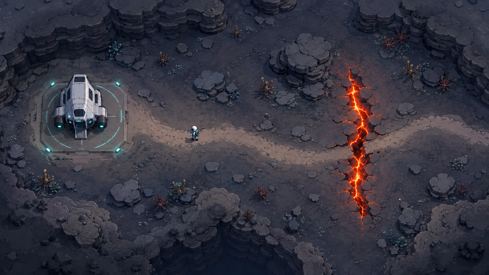

# F01 Basin Surface Concept Reference

- Status: Approved visual direction
- Approved: 2026-09-05
- Generation mode: Built-in image generation
- Runtime use: Documentation reference only; not a game asset



## Interpretation

Preserve the broad visual language rather than the rendered detail:

- A compact rocky basin and authored path, not a large open world.
- A static shuttle and cyan safe-zone accents that clearly identify the respawn origin.
- Muted charcoal, slate, dusty rust, and sand terrain.
- A strongly contrasting amber-red lethal hazard that can be read before contact.
- A lonely scientific-expedition mood using simple Godot-native placeholder visuals.

The concept does not authorize enemies, combat, a complex HUD, external art dependencies, or
asset-level reproduction during F01.

## Generation prompt

```text
Use case: stylized-concept
Asset type: preview-only 2D game environment concept and representative gameplay screenshot
Primary request: Show the proposed Landzone F01 “Basin surface” theme: a lone scientific explorer walking from a static landed shuttle along one authored exterior rock path, with a clearly readable lethal environmental hazard farther along the route and an obvious safe shuttle respawn area.
Scene/backdrop: an alien rocky basin enclosed by low layered cliffs and scattered weathered stone slabs; compact traversable corridor rather than an open world; sparse strange vegetation and subtle mineral deposits only as restrained decoration.
Subject: small top-down explorer in practical field suit, compact stationary survey shuttle, safe landing pad area, readable rock path, one dangerous glowing fissure or anomaly crossing part of the path.
Style/medium: polished but implementation-realistic 2D top-down indie game concept; clean Godot-native shapes, simple procedural-looking sprites, limited texture detail, crisp silhouettes, no photorealism, no isometric perspective.
Composition/framing: 16:9 landscape gameplay view from directly overhead with a slight top-down angle only for object readability; shuttle and player visible; path direction immediately clear; hazard separated enough to read before contact; modest empty margins suitable for later UI.
Lighting/mood: cool dusk, lonely scientific expedition, tense but readable; soft ambient shadows.
Color palette: muted charcoal, slate, dusty rust, and desaturated sand for the basin; cool cyan/teal for safe shuttle lights and player accents; intense amber-red for lethal danger; strong safe-versus-hazard contrast.
Materials/textures: layered rock, dust, fractured stone, metallic shuttle panels; restrained and feasible for placeholder art.
Constraints: no enemies, no combat, no weapons firing, no mothership interior, no cave interior, no health bar, no complex HUD, no text, no logos, no watermark; do not make it a huge open world; visual scope must feel achievable during an early Godot prototype.
```
